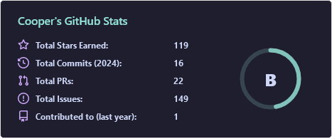

### Hi there 👋

Hi, I'm ccubed. I'm mainly interested in coding things around networking, communication, data formats, and anything that lives on the console.
  
- 🔭 I’m currently working on Folktales, a python based text game engine
- 🌱 I’m currently learning [Caddy](https://caddyserver.com/), [Authelia](https://www.authelia.com/), and [Huginn](https://github.com/huginn/huginn) to setup my new home server system
- 📫 How to reach me: [EMAIL](mailto:ccubed.techno@gmail.com)
- 💿 [My Anilist Profile](https://anilist.co/user/TakeshiKO/)
  
<!-- LIGHT -->

<!-- DARK -->

